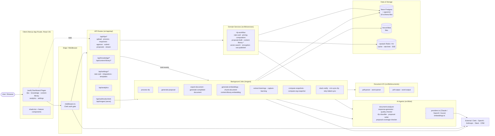
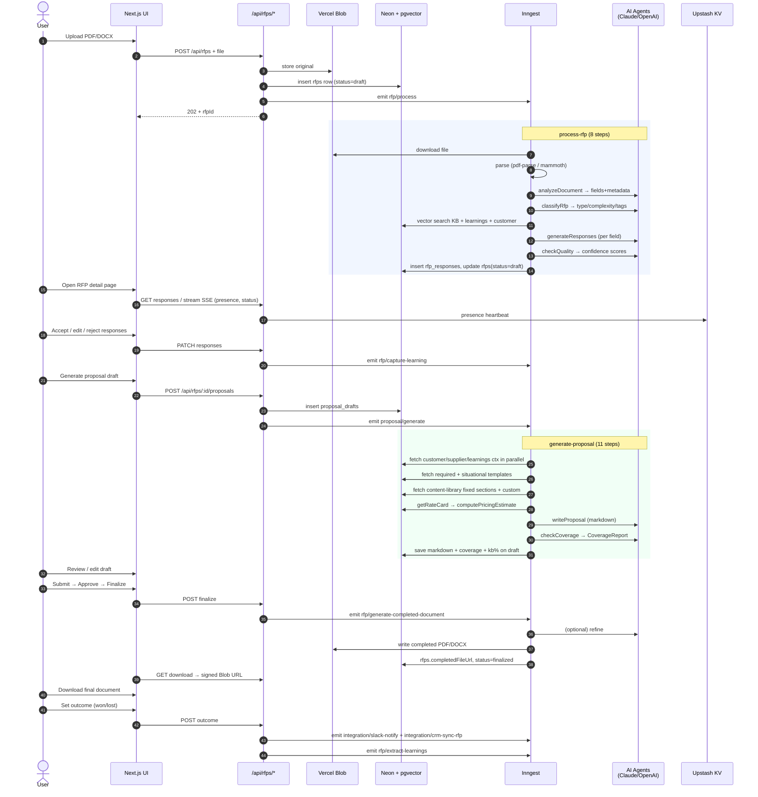

# RFP Automator — Architecture Map (High-Level)

*Generated: 2026-04-14 · Branch: `main` · Scope: top-down mental model, not exhaustive*

---

## 1. System Summary

RFP Automator is a multi-tenant Next.js 15 SaaS that **ingests inbound RFP documents (PDF/DOCX), uses a pipeline of AI agents to auto-fill the answerable fields against a per-tenant knowledge base, lets human reviewers refine responses, optionally generates a full proposal draft (with pricing from a rate card), and exports the completed document back to PDF/DOCX**. Tenancy is enforced via Clerk Organizations; long-running AI work runs as Inngest background functions; vector search uses pgvector on Neon; pricing and proposal composition read from a structured Content Library + rate card. Outcomes (won/lost) feed an analytics snapshot pipeline and can sync to Slack/CRM integrations.

---

## 2. Top-Level Component Diagram

---

## 3. Subsystem Breakdown

| Subsystem | Purpose | Key Entry Points | External Deps | Decomposability |
|-----------|---------|------------------|---------------|-----------------|
| **Auth & Tenancy** | Gate all non-public routes, resolve `organizationId` + role from Clerk session. | `src/middleware.ts`, `src/lib/utils/auth.ts`, `src/app/api/webhooks/clerk` | Clerk Organizations, `svix` | **Clean** — thin middleware + single `requireAdmin`/`requireAuth` helper. |
| **RFP Ingestion** | Upload PDF/DOCX to Blob, record `rfps` row, kick off `rfp/process`. | `src/app/api/rfps/route.ts`, `src/app/api/rfps/[rfpId]/upload`, `src/app/api/rfps/[rfpId]/process` | Vercel Blob, Inngest | **Clean** — small surface, delegates to Inngest immediately. |
| **Document Parse / Emit** | Parse PDF/DOCX to structured fields; render back to PDF/DOCX with overlays. | `src/lib/documents/{pdf-parser,word-parser,pdf-output,word-output}.ts` | `pdf-parse`, `pdf-lib`, `mammoth`, `docx` | **Clean** — four focused modules, I/O boundary. |
| **AI Agents** | Prompted units of work over Vercel AI SDK: analyze, generate, QA, classify, write, cover-check. | `src/lib/ai/agents/*.ts`, `src/lib/ai/providers.ts`, `src/lib/ai/embeddings.ts` | `@ai-sdk/anthropic`, `@ai-sdk/openai`, `ai` | **Mixed** — 7 agents share provider config but prompts/schemas are duplicated inline per agent. |
| **Proposal Generation Pipeline** | Orchestrated multi-step Inngest job composing retrieval + writer + coverage + template/pricing injection. | `src/lib/inngest/functions/generate-proposal.ts`, `src/lib/services/proposal-*.ts` | Inngest, DB, AI | **Tangled** — single function with 11 steps touching 6+ services and heavy type-casts around `Jsonify`; ripe for decomposition. |
| **RFP Processing Pipeline** | Inngest job: download → parse → analyze → classify → retrieve → generate → QA → persist. | `src/lib/inngest/functions/process-rfp.ts` | Inngest, Blob, DB, AI | **Mixed** — clearly stepped but couples BYOK key resolution, customer/learning merging, and schema conversion in one file. |
| **Content Library & KB** | Store + embed + retrieve past answers, case studies, company docs, fixed sections. Vector search via pgvector. | `src/app/api/knowledge`, `src/app/api/content-library`, `src/lib/services/{vector-search,content-library-retrieval,content-library-search,proposal-retrieval}.ts`, `knowledge-entries`, `proposal-content-library` schemas | OpenAI embeddings, pgvector | **Mixed** — two parallel domains (knowledge vs. content-library) with overlapping retrieval helpers. |
| **Rate Card & Pricing** | Structured per-tenant pricing catalog + scope-line estimator used during proposal generation. | `src/lib/services/{rate-card,pricing-computation,scope-line-parser}.ts`, `src/app/api/settings/rate-card`, `src/components/settings/RateCardForm.tsx` | DB, Zod | **Clean** — self-contained, well-tested. |
| **Review & Workflow UI** | Human-in-the-loop dashboard: response cards, approval, return, assign, versioning, presence, proposals editor. | `src/app/(auth)/rfps/[id]/page.tsx`, `src/components/rfp/*`, `/api/rfps/[rfpId]/{approve,return,submit,finalize,assign,outcome,presence,stream,versions,responses}` | DB, KV (SSE) | **Mixed** — many small focused components but the RFP detail page is the convergence point for ~20 panels. |
| **Analytics** | Pre-computed snapshots + dashboard (metrics, volume, win/loss, contributors). | `src/app/api/analytics/route.ts`, `src/components/analytics/*`, `src/lib/services/analytics.ts`, `src/lib/inngest/functions/compute-*snapshot*.ts` | Inngest cron, DB, KV cache | **Clean** — read path cached; compute path isolated. |
| **Integrations (Slack/CRM)** | Outbound sync jobs + config UI; retry pipeline on failure. | `src/lib/inngest/functions/{slack-notify,crm-sync-rfp,retry-failed-sync}.ts`, `/api/settings/integrations`, `integration-configs` + `sync-events` schemas | Slack API, CRM API | **Clean** — each integration is its own Inngest function; pattern is consistent. |
| **Learning Flywheel** | Capture accept/edit/reject signals and extract durable learnings back into KB. | `/api/learnings`, `src/lib/inngest/functions/{capture-learning,extract-learnings}.ts`, `src/lib/services/learning-capture.ts` | DB, AI | **Mixed** — clear event model, but learning injection back into retrieval is distributed across multiple services. |
| **Storage/Cache Adapters** | Blob wrapper + KV/Redis wrapper used everywhere. | `src/lib/storage/{blob,kv}.ts` | Vercel Blob, Upstash | **Clean** — thin adapters. |

---

## 4. Runtime Data Flow — Upload RFP → Delivered Proposal

---

## 5. Cross-Cutting Concerns

| Concern | Where it lives |
|---------|----------------|
| **Auth / tenancy** | `src/middleware.ts` (Clerk route guard) + `src/lib/utils/auth.ts` (`requireAuth`, `requireAdmin`). Every DB query scopes by `organizationId`. |
| **Input validation** | `src/lib/utils/validation.ts` — central Zod schemas (`.strict()` JSONB, `.refine()` cross-field). Route handlers wrap `request.json()` in try/catch → 400. |
| **Error handling** | `AuthError` class in `utils/auth.ts`; Inngest functions use per-step try/catch returning fallback values for non-critical steps (classification, context fetch). Proposal generation wraps the whole body and writes `status='error'` + `generationError` to the draft. |
| **Caching** | `src/lib/storage/kv.ts` — analytics snapshots cached in KV; SSE channels via KV pub/sub (`sse-publisher.ts`). |
| **Rate limiting** | `src/lib/utils/rate-limit.ts` (Upstash `@upstash/ratelimit`). |
| **Secrets / BYOK keys** | `tenant_settings` holds encrypted provider keys; `src/lib/services/encryption.ts` wraps encrypt/decrypt. Keys are resolved **outside** `step.run` in Inngest so they are never persisted in step state. |
| **Background jobs** | `src/lib/inngest/client.ts` (typed `Events` union) + 15 functions in `src/lib/inngest/functions/`, all registered in `src/app/api/inngest/route.ts`. |
| **Feature flags** | None observed as a dedicated system; behavior gated by `tenant_settings` columns (e.g., `llmProvider`, `companyProfile`) and per-template `isRequired` / trigger arrays. |
| **Real-time** | Server-Sent Events route `/api/rfps/[rfpId]/stream` + `presence` heartbeat + `sse-publisher.ts`. Optimistic locking via `rfp_responses.version`. |
| **Observability** | `src/instrumentation.ts` (Next.js hook) + `@vercel/analytics`. No explicit logger wrapper observed. |

---

## 6. Drill-Down Candidates (ranked by complexity / risk)

1. **`generate-proposal` Inngest function** — `src/lib/inngest/functions/generate-proposal.ts`
   *Highest complexity.* 11 steps, 6+ service dependencies, casts around `Jsonify<T>`, merges templates + content library + rate card + coverage. A deep-dive codemap should diagram step dependencies, show what each service returns, and flag which steps can fail silently (fallbacks) vs. abort.

2. **`process-rfp` Inngest function** — `src/lib/inngest/functions/process-rfp.ts`
   Similar shape to generate-proposal but with document I/O + classification + per-field AI. Deep-dive should cover Buffer serialization workaround, BYOK key lifecycle, and how `rfp_responses` position data flows back to overlay rendering.

3. **Content Library + Knowledge retrieval** — `src/lib/services/{vector-search, proposal-retrieval, content-library-retrieval, content-library-search}.ts` + two schemas (`knowledge-entries`, `proposal-content-library`).
   Two parallel retrieval surfaces that partially overlap. Drill-down should map: what tables each function queries, which embedding model is assumed, and where similarity thresholds/top-K are configured.

4. **AI agents layer** — `src/lib/ai/agents/*`
   Seven agents, each with its own prompt, Zod output schema, and provider call. Drill-down should catalog: input schema, output schema, prompt size, model used, token cost estimate, and duplication across agents.

5. **RFP detail page + response lifecycle** — `src/app/(auth)/rfps/[id]/page.tsx` + ~22 components in `src/components/rfp/`.
   Convergence point for workflow state, presence, versioning, coverage panel, proposal editor. Deep-dive should produce a state diagram of `rfps.status` transitions and which UI affordances are gated by role/status.

6. **Rate card + pricing computation** — `src/lib/services/{rate-card, pricing-computation, scope-line-parser}.ts`
   Small but business-critical. Drill-down should enumerate pricing modes (`time_and_materials`, blended vs by_role, discount rules) and how `clarifyingQuestions → scopeLines → estimate` is derived.

7. **Integration + sync events** — `slack-notify.ts`, `crm-sync-rfp.ts`, `retry-failed-sync.ts`, `sync_events` table.
   Outbound side-effects with retry. Drill-down should cover the state machine for a `sync_event` and where retry is triggered.

8. **Learning flywheel** — `capture-learning.ts`, `extract-learnings.ts`, `learnings` table, `learning-capture.ts`.
   Understand how accept/edit/reject signals become durable context that feeds back into retrieval, and whether customer-scoped learnings are actually prioritized in prompts.

---

## 7. DRY / Modularity Observations

1. **Well-reused.** The `storage/blob.ts`, `storage/kv.ts`, `services/encryption.ts`, and `utils/auth.ts` adapters are thin and imported consistently — good. The Inngest `Events` union in `client.ts` gives type safety to every emitter and is a strong seam.

2. **Duplication across AI agents.** Each agent in `src/lib/ai/agents/` independently constructs its provider client via `providers.ts` and redefines its own Zod output schema inline. A shared `runAgent({ prompt, schema, providerConfig })` wrapper would remove ~7 copies of the same boilerplate and standardize retry/error handling.

3. **Two overlapping retrieval stacks.** `proposal-retrieval.ts`, `vector-search.ts`, `content-library-retrieval.ts`, and `content-library-search.ts` each do "embed query + pgvector top-K against some table." These *should* share a generic vector-search primitive parameterized by table+embedding column; today they are near-copies.

4. **BYOK key resolution duplicated in Inngest functions.** Both `process-rfp.ts` and `generate-proposal.ts` open with a bespoke IIFE that reads `tenant_settings`, picks the provider-specific encrypted column, decrypts, and returns `{providerConfig, openaiApiKey}`. This belongs in a `services/tenant-llm-config.ts` helper — it would also centralize the "keys must live outside `step.run`" invariant that is currently enforced only by comments.

5. **Validation schemas are centralized but JSONB shapes aren't.** `utils/validation.ts` holds Zod schemas, but the TypeScript shapes of JSONB columns (e.g., `ExtractedRfpMetadata`, `parsedStructure` in `rfps.ts`, `CoverageReport` in `proposal-drafts.ts`) live next to the Drizzle table and are redeclared by consumers. A single `src/types/` or co-located `rfps.types.ts` imported by both schema and validators would remove drift risk.

---

## 8. What I Did Not Explore (handoff hints)

- Actual SQL of the 11 migrations in `drizzle/` (schema files were read; raw DDL was not).
- Client-side state management details (Zustand stores, form hooks).
- Playwright E2E flows in `/e2e` — would reveal canonical user journeys.
- Exact model IDs / prompt text inside each AI agent.
- Test coverage by subsystem (aggregate target is 80%; per-area distribution unknown).
- Deployment / Vercel project config (`next.config.ts`, `vercel.json` if any).

These are the right starting points for the first round of drill-downs.
