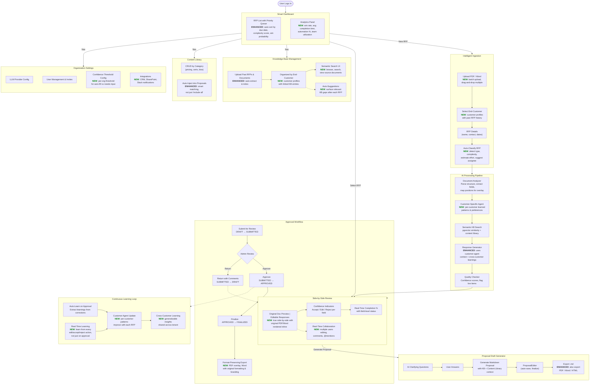
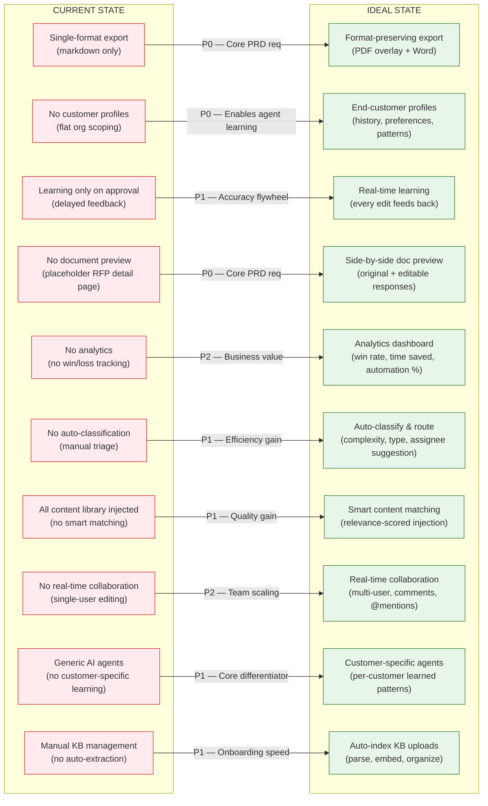
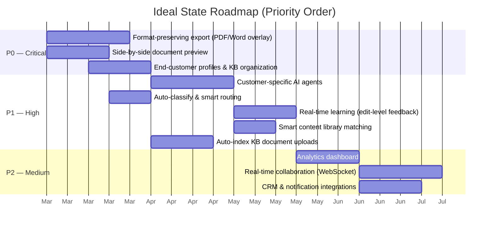

# RFP Automator — Ideal End State

This document contrasts the **current implementation** with the **ideal end state** for efficient, effective RFP processing. Items marked with `NEW` do not exist today. Items marked `ENHANCED` exist but need significant improvement.

---

## Current vs Ideal: User Workflow

---

## Ideal Technical Architecture

```mermaid
flowchart TD
    subgraph Client["Client Layer"]
        NextJS["Next.js 15 App Router<br/>React Server Components<br/>+ Client Islands"]
        RT["Real-Time Layer<br/><b style='color:green'>NEW</b>: WebSocket / SSE<br/>for live collaboration"]
    end

    subgraph Edge["Edge & CDN"]
        Middleware["Clerk Auth Middleware"]
        Cache["Vercel Edge Cache<br/>+ KV for hot data"]
    end

    subgraph API["API Layer (Next.js Route Handlers)"]
        RFP_API["RFP CRUD + Workflow"]
        Proposal_API["Proposal Generator"]
        KB_API["Knowledge Base API<br/><b style='color:green'>NEW</b>: document upload,<br/>auto-indexing pipeline"]
        Analytics_API["Analytics API<br/><b style='color:green'>NEW</b>: win rates,<br/>time metrics, utilization"]
    end

    subgraph Jobs["Background Jobs (Inngest)"]
        Process["rfp/process-rfp<br/>Parse → Retrieve → Generate → QA"]
        GenProposal["rfp/generate-proposal<br/>Questions → Write → Cite"]
        ExtractLearn["rfp/extract-learnings"]
        DocExport["rfp/export-document<br/><b style='color:green'>NEW</b>: PDF overlay,<br/>Word generation"]
        Embed["rfp/generate-embeddings"]
        Classify["rfp/classify-rfp<br/><b style='color:green'>NEW</b>: auto-type,<br/>complexity, effort estimate"]
    end

    subgraph AI["AI Agent Layer"]
        Orchestrator["RFP Orchestrator"]
        DocAnalyzer["Document Analyzer"]
        CustomerAgent["Customer-Specific Agent<br/><b style='color:green'>NEW</b>: per-customer<br/>learned patterns"]
        RespGen["Response Generator"]
        QualityCheck["Quality Checker"]
        ProposalQGen["Proposal Question Generator"]
        ProposalWriter["Proposal Writer"]
    end

    subgraph Data["Data Layer"]
        Neon["Neon PostgreSQL<br/>+ pgvector"]
        Blob["Vercel Blob<br/>Original + Generated docs"]
        KV["Vercel KV / Upstash Redis<br/>Cache + Rate Limiting"]
    end

    subgraph LLM["LLM Providers (per-org config)"]
        Claude["Claude API"]
        GPT["OpenAI API"]
        Azure["Azure OpenAI"]
    end

    Client --> Edge --> API
    API --> Jobs
    Jobs --> AI
    AI --> Data
    AI --> LLM
    API --> Data

    classDef newBlock fill:#e8f5e9,stroke:#388e3c,stroke-width:2px,stroke-dasharray:5
```

---

## Gap Analysis: Current vs Ideal

---

## Priority Roadmap

---

## Summary of Key Differences

| Area | Current | Ideal | Priority |
|------|---------|-------|----------|
| **Export** | Markdown only | PDF overlay + Word preserving original format & branding | P0 |
| **Document Review** | Placeholder page, no original doc view | Side-by-side: original rendered + editable responses | P0 |
| **Customer Context** | Flat org scoping, no customer profiles | End-customer profiles with history, preferences, linked KB | P0 |
| **AI Agents** | Generic pipeline (same for all customers) | Customer-specific agents with learned patterns per customer | P1 |
| **Learning** | Batch on approval only | Real-time: every accept/edit/reject feeds back immediately | P1 |
| **RFP Triage** | Manual assignment, no classification | Auto-classify type & complexity, suggest assignee, priority queue | P1 |
| **Content Library** | Inject all entries into every proposal | Relevance-scored smart matching per RFP context | P1 |
| **KB Management** | Manual CRUD entries | Auto-parse uploaded docs, extract & embed, organize by customer | P1 |
| **Analytics** | None | Win rate, automation %, time saved, team utilization | P2 |
| **Collaboration** | Single-user editing | Real-time multi-user with comments and @mentions | P2 |
| **Integrations** | None | CRM (Salesforce/HubSpot), SharePoint, Slack notifications | P2 |

Summary
P0 — Critical gaps (core PRD requirements not yet built):
  - Format-preserving export — Currently markdown only; ideal is PDF overlay + Word with original formatting/branding preserved
  - Side-by-side document review — Currently a placeholder detail page; ideal renders the original doc alongside editable responses
  - End-customer profiles — Currently flat org scoping; ideal has per-customer profiles with RFP history and linked KB entries

  P1 — High-impact (the accuracy flywheel):
  - Customer-specific AI agents — Currently one generic pipeline; ideal has per-customer learned patterns that improve with each RFP
  - Real-time learning — Currently only captures on approval; ideal learns from every accept/edit/reject action
  - Auto-classification & routing — Currently manual triage; ideal auto-detects RFP type, complexity, and suggests assignee
  - Smart content library matching — Currently injects all entries; ideal scores relevance per RFP context
  - Auto-index KB uploads — Currently manual entry; ideal parses uploaded docs and auto-extracts/embeds

  P2 — Medium (team scaling & business insight):
  - Analytics dashboard, real-time collaboration, CRM/Slack integrations

  The Gantt chart in the file shows a suggested implementation roadmap ordering these by dependency and priority.