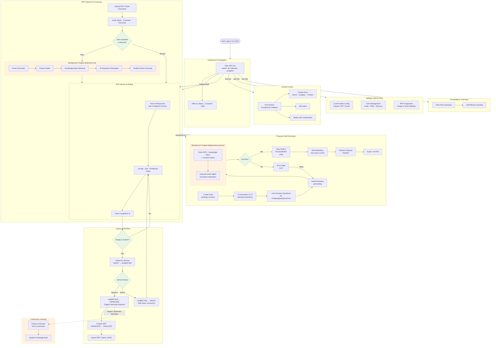
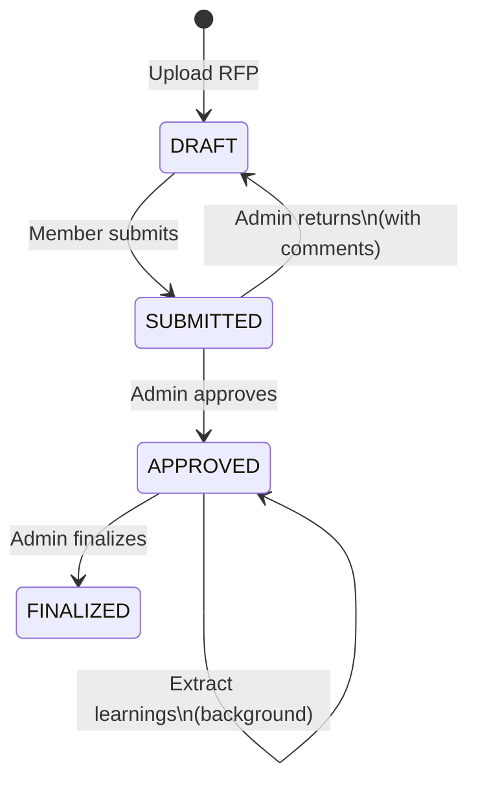
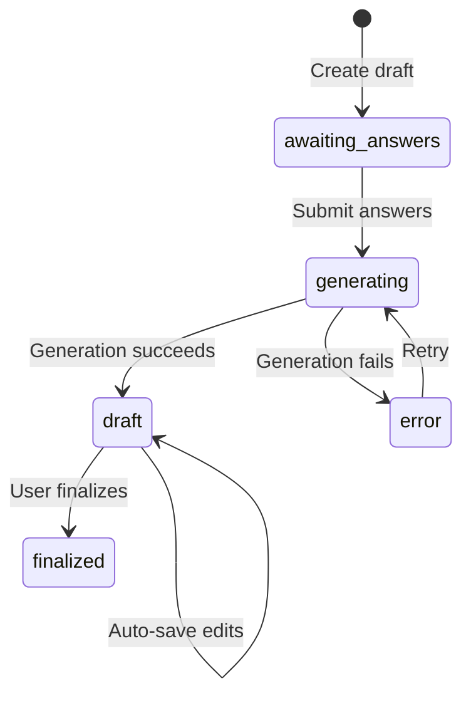
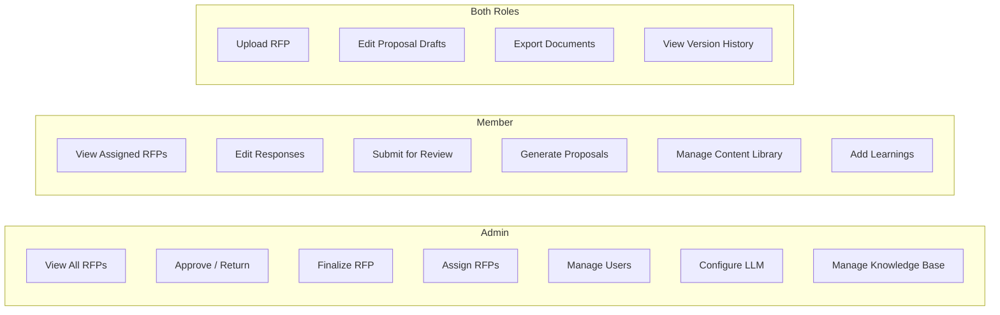

# RFP Automator — User Workflow Diagram

## End-to-End User Journey

```mermaid
flowchart TD
    %% ── Entry ──
    Login([User Logs In via Clerk])
    Login --> Dashboard

    subgraph Dashboard["Dashboard & Navigation"]
        Dashboard_View[View RFP List<br/><i>Admin: all / Member: assigned</i>]
        Filter[Filter by Status · Customer · Date]
        Dashboard_View --> Filter
    end

    Dashboard_View -->|New RFP| Upload
    Dashboard_View -->|Select RFP| RFP_Detail
    Dashboard_View -->|Nav link| ContentLib
    Dashboard_View -->|Nav link| Settings
    Dashboard_View -->|Nav link| Learnings

    %% ── RFP Upload ──
    subgraph Upload["RFP Upload & Processing"]
        Upload_Doc[Upload PDF / Word Document]
        Enter_Details[Enter Name · Customer · Due Date]
        Choose_Mode{Auto-complete<br/>or Manual?}
        Upload_Doc --> Enter_Details --> Choose_Mode
        Choose_Mode -->|Auto| Inngest_Process
        Choose_Mode -->|Manual| RFP_Detail

        subgraph Inngest_Process["Background: Inngest rfp/process-rfp"]
            Parse[Parse Document]
            Extract[Extract Fields]
            Retrieve[Knowledge Base Retrieval]
            Generate_Resp[AI Response Generation]
            QA[Quality Check & Scoring]
            Parse --> Extract --> Retrieve --> Generate_Resp --> QA
        end
        Inngest_Process --> RFP_Detail
    end

    %% ── RFP Review & Edit ──
    subgraph RFP_Detail["RFP Review & Editing"]
        View_Responses[View AI Responses<br/>with Confidence Scores]
        Edit_Responses[Accept · Edit · Fill Manual Fields]
        Track_Progress[Track Completion %]
        View_Responses --> Edit_Responses --> Track_Progress
    end

    Track_Progress --> Submit_Decision
    RFP_Detail -->|Generate Proposal| Proposal_Wizard

    %% ── Approval Workflow ──
    subgraph Approval["Approval Workflow"]
        Submit_Decision{Ready to Submit?}
        Submit_Decision -->|Yes| Submit[Submit for Review<br/>DRAFT → SUBMITTED]
        Submit_Decision -->|No| Edit_Responses

        Submit --> Admin_Review{Admin Review}
        Admin_Review -->|Approve| Approved[SUBMITTED → APPROVED<br/><i>Triggers learning extraction</i>]
        Admin_Review -->|Return| Returned[SUBMITTED → DRAFT<br/><i>With return comments</i>]
        Returned --> Edit_Responses

        Approved --> Finalize_RFP[Finalize RFP<br/>APPROVED → FINALIZED]
        Finalize_RFP --> Export_RFP[Export PDF / Word / JSON]
    end

    %% ── Learning Extraction ──
    subgraph Learning["Continuous Learning"]
        Approved -.->|Inngest: rfp/extract-learnings| Extract_Learn[Extract Learnings<br/>from Corrections]
        Extract_Learn --> KB_Update[Update Knowledge Base]
    end

    %% ── Proposal Draft Generator ──
    subgraph Proposal_Wizard["Proposal Draft Generator"]
        Create_Draft[Create Draft<br/><i>awaiting_answers</i>]
        Questions[AI Generates 3–10<br/>Clarifying Questions]
        Answer_Form[User Answers Questions<br/>via ClarifyingQuestionsForm]
        Submit_Answers[Submit Answers<br/><i>generating</i>]

        Create_Draft --> Questions --> Answer_Form --> Submit_Answers

        subgraph Inngest_Proposal["Background: Inngest rfp/generate-proposal"]
            Fetch_Context[Fetch RFP + Knowledge Base<br/>+ Content Library]
            Write_Proposal[proposal-writer Agent<br/>Generates Markdown]
            Fetch_Context --> Write_Proposal
        end
        Submit_Answers --> Inngest_Proposal

        Inngest_Proposal --> Draft_Ready{Success?}
        Draft_Ready -->|Yes| View_Draft[View Draft in<br/>ProposalEditor<br/><i>draft</i>]
        Draft_Ready -->|No| Error_State[Error State<br/><i>error</i>]
        Error_State -->|Retry| Submit_Answers

        View_Draft --> Edit_Proposal[Edit Markdown<br/><i>Auto-save on blur</i>]
        Edit_Proposal --> Finalize_Proposal[Finalize Proposal<br/><i>finalized</i>]
        Finalize_Proposal --> Export_Proposal[Export .md File]
    end

    %% ── Content Library ──
    subgraph ContentLib["Content Library"]
        View_Library[View Entries<br/>Grouped by Category]
        Create_Entry[Create Entry<br/>Name · Category · Content]
        Edit_Entry[Edit Inline]
        Delete_Entry[Delete with Confirmation]
        View_Library --> Create_Entry
        View_Library --> Edit_Entry
        View_Library --> Delete_Entry
    end

    %% ── Settings ──
    subgraph Settings["Settings (Admin Only)"]
        LLM_Config[LLM Provider Config<br/>Claude / GPT / Azure]
        User_Mgmt[User Management<br/>Invite · Roles · Remove]
        RFP_Assign[RFP Assignment<br/>Assign to Team Member]
        LLM_Config ~~~ User_Mgmt ~~~ RFP_Assign
    end

    %% ── Manual Learnings ──
    subgraph Learnings["Knowledge & Learnings"]
        View_Learnings[View Past Learnings]
        Add_Learning[Add Manual Learning]
        View_Learnings --> Add_Learning
    end

    %% ── Styling ──
    classDef bg fill:#f0f4ff,stroke:#4a6cf7,stroke-width:1px
    classDef inngest fill:#fff3e0,stroke:#ff9800,stroke-width:1px,stroke-dasharray:5
    classDef decision fill:#e8f5e9,stroke:#4caf50,stroke-width:1px
    classDef action fill:#fff,stroke:#333,stroke-width:1px

    class Inngest_Process,Inngest_Proposal,Learning inngest
    class Choose_Mode,Submit_Decision,Admin_Review,Draft_Ready decision
```

## RFP Status Lifecycle

```mermaid
stateDiagram-v2
    [*] --> DRAFT: Upload RFP
    DRAFT --> SUBMITTED: Member submits
    SUBMITTED --> APPROVED: Admin approves
    SUBMITTED --> DRAFT: Admin returns\n(with comments)
    APPROVED --> FINALIZED: Admin finalizes

    APPROVED --> APPROVED: Extract learnings\n(background)
```

## Proposal Draft Lifecycle

```mermaid
stateDiagram-v2
    [*] --> awaiting_answers: Create draft
    awaiting_answers --> generating: Submit answers
    generating --> draft: Generation succeeds
    generating --> error: Generation fails
    error --> generating: Retry
    draft --> finalized: User finalizes
    draft --> draft: Auto-save edits
```

## Role-Based Access

```mermaid
flowchart LR
    subgraph Admin["Admin"]
        A1[View All RFPs]
        A2[Approve / Return]
        A3[Finalize RFP]
        A4[Assign RFPs]
        A5[Manage Users]
        A6[Configure LLM]
        A7[Manage Knowledge Base]
    end

    subgraph Member["Member"]
        M1[View Assigned RFPs]
        M2[Edit Responses]
        M3[Submit for Review]
        M4[Generate Proposals]
        M5[Manage Content Library]
        M6[Add Learnings]
    end

    subgraph Shared["Both Roles"]
        S1[Upload RFP]
        S2[Edit Proposal Drafts]
        S3[Export Documents]
        S4[View Version History]
    end
```
